# 📊 Smart E-Commerce Sales Analytics Dashboard

An interactive multi-page dashboard built using **Python**, **Streamlit**, **Pandas**, **Plotly Express**, and **Scikit-learn** to analyze the **Enhanced_Superstore** dataset and generate meaningful business insights along with sales forecasting using Machine Learning.

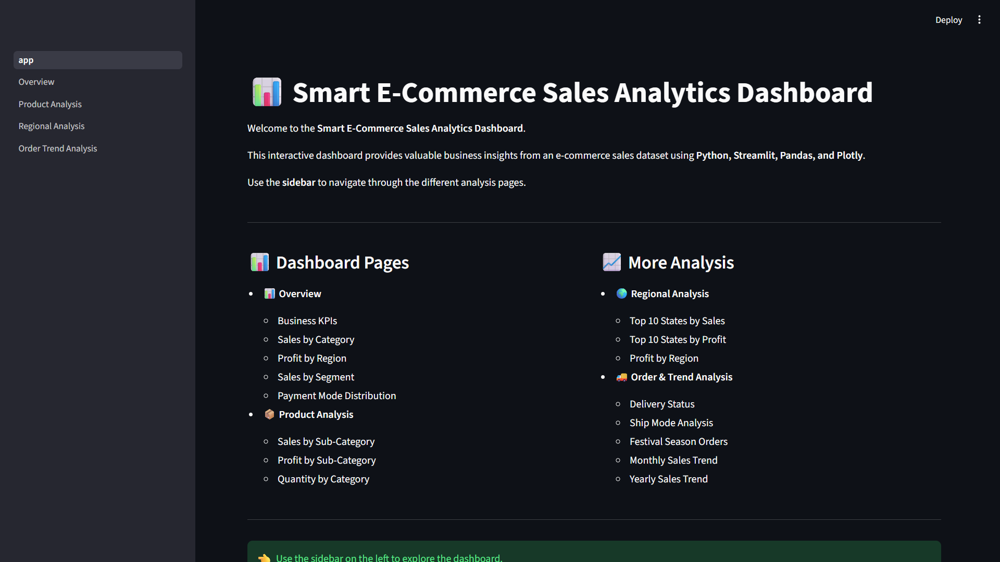

---

# 📌 Project Overview

The **Smart E-Commerce Sales Analytics Dashboard** is designed to help businesses analyze sales performance through interactive visualizations, KPI cards, filters, and predictive analytics.

The dashboard enables users to explore product performance, regional sales, customer purchasing behavior, order trends, and forecast future sales using a Linear Regression Machine Learning model.

---

# ✨ Features

* 📊 Interactive Multi-Page Dashboard
* 📈 KPI Cards (Sales, Profit, Orders, Average Discount)
* 🔍 Dynamic Sidebar Filters
* 📦 Product Analysis
* 🌍 Regional Analysis
* 🚚 Order & Trend Analysis
* 📅 Monthly & Yearly Sales Trends
* 🤖 Machine Learning Sales Forecasting
* 💡 Business Insights & Business Recommendations
* 📥 Download Filtered Dataset

---

# 🛠️ Technologies Used

* Python
* Streamlit
* Pandas
* NumPy
* Plotly Express
* Scikit-learn

---

# 📂 Dataset

**Dataset Name:** Enhanced_Superstore.csv

The dataset contains sales information including:

* Order Date
* Region
* State
* Category
* Sub-Category
* Segment
* Ship Mode
* Sales
* Profit
* Quantity
* Discount
* Payment Mode
* Delivery Status
* Festival Season

---

# 📂 Project Structure

```text
ECommerce_Sales_Analysis/
│
├── dataset/
│   └── Enhanced_Superstore.csv
│
├── dashboard/
│   ├── app.py
│   └── pages/
│       ├── 1_Overview.py
│       ├── 2_Product_Analysis.py
│       ├── 3_Regional_Analysis.py
│       ├── 4_Order_Trend_Analysis.py
│       └── 5_ML_Sales_Forecasting.py
│
├── notebook/
├──  screenshots/
│    │
│    ├── home1.png
│    ├── home2.png
│    ├── overview1.png
│    ├── overview2.png
│    ├── product_analysis1.png
│    ├── product_analysis2.png
│    ├── product_analysis3.png
│    ├── regional_analysis1.png
│    ├── regional_analysis2.png
│    ├── order_trend_analysis1.png
│    ├── order_trend_analysis2.png
│    ├── order_trend_analysis3.png
│    ├── sales_forecasting1.png
│    └── sales_forecasting2.png
├── report/
├── requirements.txt
└── README.md
```

---

# 📊 Dashboard Pages

## 🏠 Home

* Project Introduction
* Dashboard Navigation
* Dataset Summary
* Technologies Used
* Download Dataset

---

## 📊 Overview

* KPI Cards
* Sales by Category
* Profit by Region
* Sales by Segment
* Payment Mode Distribution
* Business Insights

---

## 📦 Product Analysis

* Sales by Sub-Category
* Profit by Sub-Category
* Quantity by Category
* Business Insights

---

## 🌍 Regional Analysis

* Top 10 States by Sales
* Top 10 States by Profit
* Profit by Region
* Business Insights

---

## 🚚 Order & Trend Analysis

* Delivery Status
* Sales by Ship Mode
* Orders by Festival Season
* Monthly Sales Trend
* Yearly Sales Trend
* Business Insights

---

## 🤖 Sales Forecasting (Machine Learning)

* Linear Regression Model
* Actual vs Forecast Sales
* Next 6 Months Sales Prediction
* Forecast Summary
* Machine Learning Insight
* Business Recommendations

---

# 📸 Dashboard Screenshots

## 🏠 Home


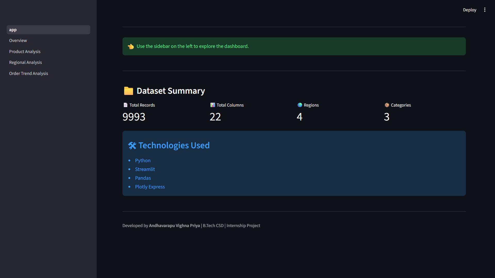

---

## 📊 Overview

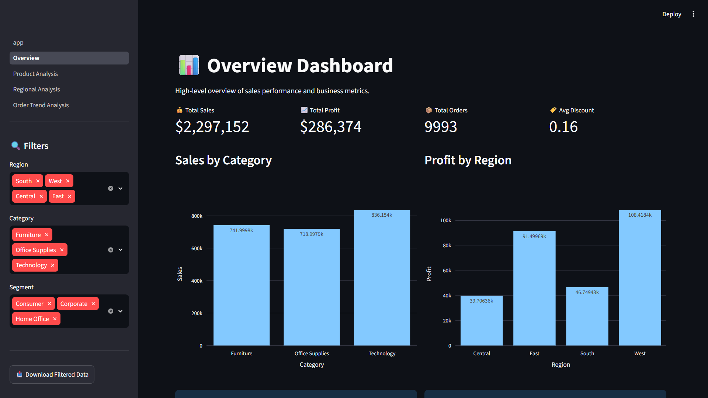

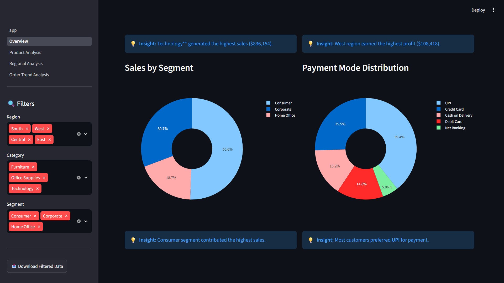

---

## 📦 Product Analysis

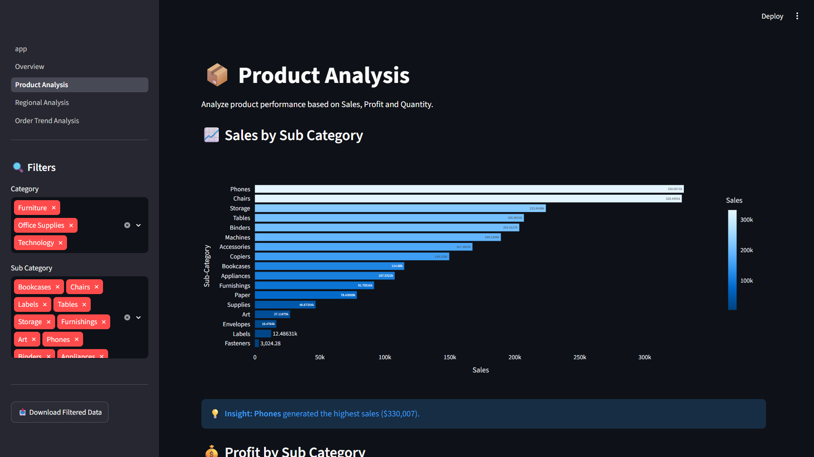

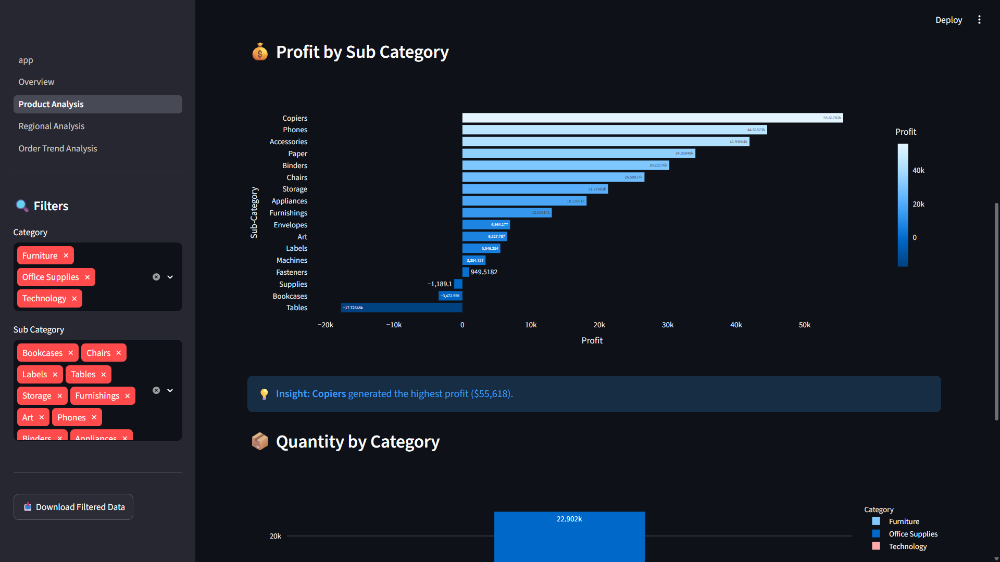

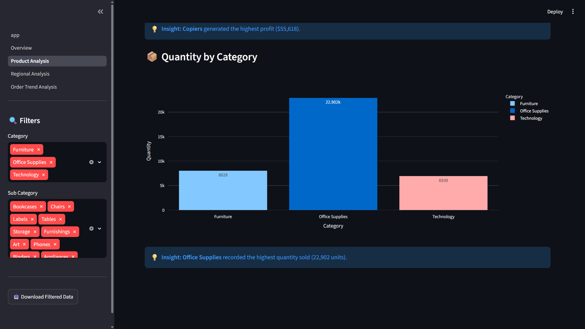

---

## 🌍 Regional Analysis

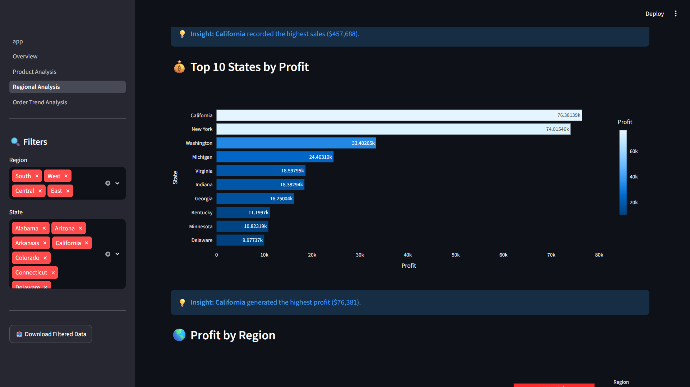

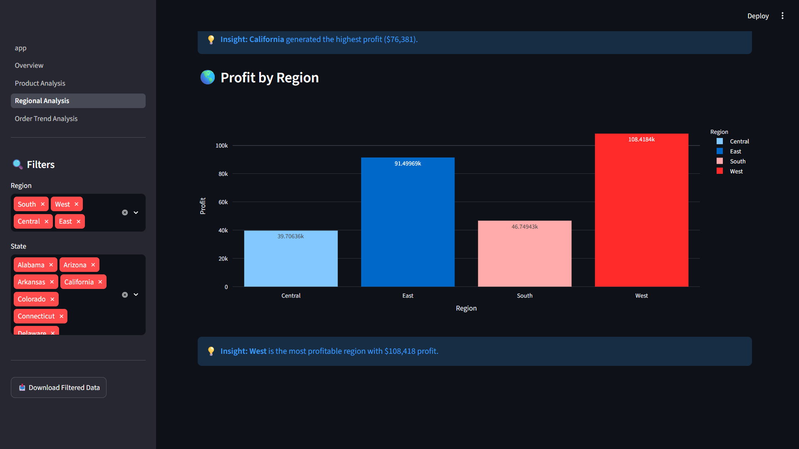

---

## 🚚 Order & Trend Analysis

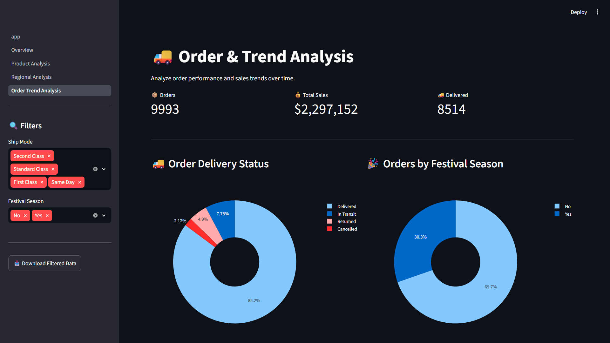

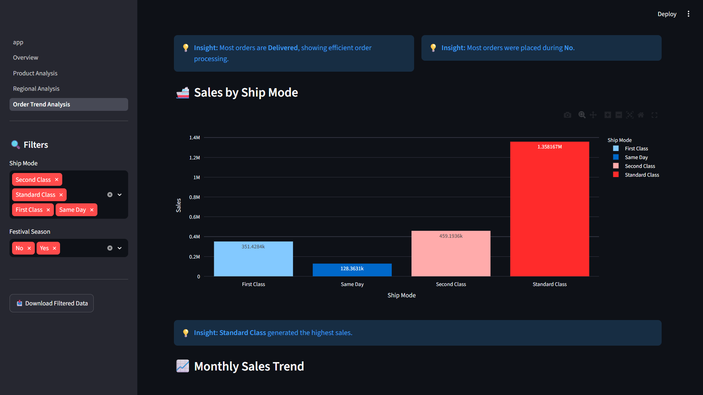

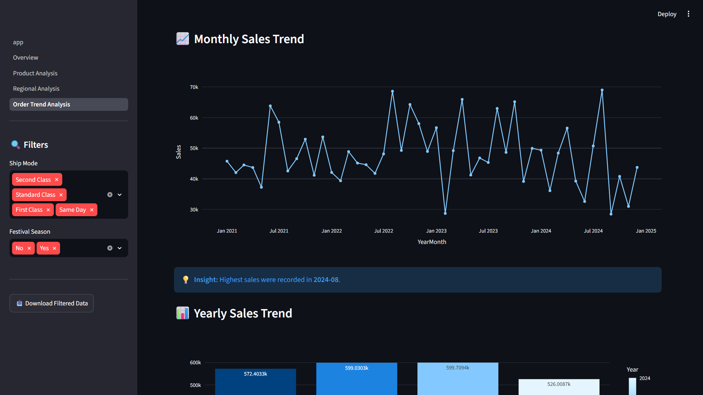

---

## 🤖 Sales Forecasting

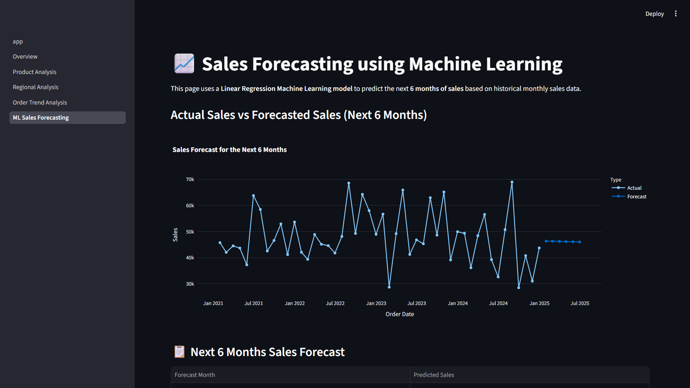

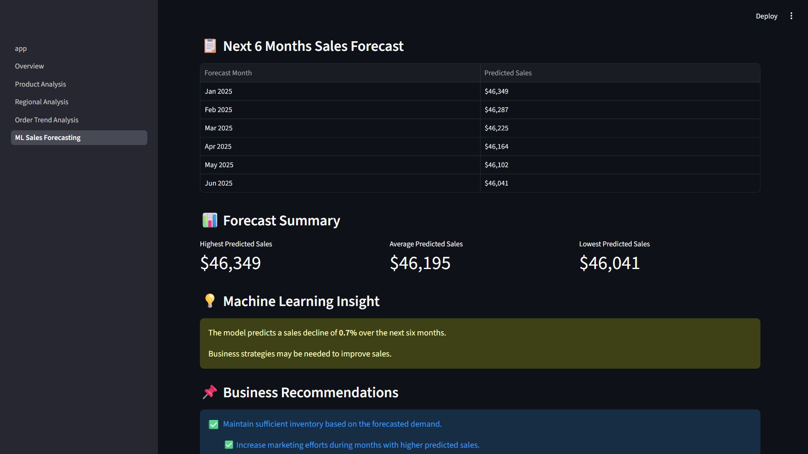
---

# 🚀 How to Run the Project

### 1. Clone the repository

```bash
git clone <repository-link>
```

### 2. Install required libraries

```bash
pip install -r requirements.txt
```

### 3. Navigate to the dashboard folder

```bash
cd dashboard
```

### 4. Run the Streamlit application

```bash
streamlit run app.py
```

---

# 📈 Machine Learning Model

This project uses the **Linear Regression** algorithm from **Scikit-learn** to predict future monthly sales based on historical sales data.

The forecasting module predicts the **next six months of sales** and provides business recommendations based on the prediction results.

---

# 🔮 Future Enhancements

* 🤖 AI-generated business insights using Large Language Models (LLMs).
* 📂 Support for user-uploaded datasets with automatic column validation.
* 📄 Export dashboard reports as PDF and Excel.
* 🗺️ Interactive geographical maps for regional sales analysis.
* 🔔 Real-time dashboard connected to live business data.

---

# 👩‍💻 Developer

**Andhavarapu Vighna Priya**

**B.Tech – Computer Science & Design (CSD)**

Internship Project

---

# ⭐ Conclusion

The **Smart E-Commerce Sales Analytics Dashboard** transforms raw e-commerce sales data into meaningful visual insights and future sales predictions. By combining interactive analytics with Machine Learning forecasting, the dashboard helps users make informed, data-driven business decisions.

